# Wells 4 Hydrogeology (w4h) 

The w4h Python package is a package designed jointly by the Illinois State Geological Survey and Illinois State Water Survey.

It is designed to read in geology data from wells and create a layered, gridded hydrogeologic model of a study region, all within a python environment, automating and performing tasks often carried out in a dedicated GIS software.

The w4h package contains all the functions needed for getting N layers of a hydrogeology grid. 
Though the source code is split into separate modules, all functions are designed to be accessed directly from the w4h module (example: w4h.read_study_area())

The w4h module is designed to be flexible and customizable, allowing various kinds of data to be read in, with many different kinds of initial structures.

Using well descriptions from these database tables, the code contained here extracts, manipulates, and organizes the data to be used for hydrogeologic modeling. The scripts here can be used for specific regions of interests/study areas within the state, or for the state as a whole.

# Dependencies
 The w4h module has the following dependencies:
- numpy
- pandas
- rioxarray (and therefore xarray)
- geopandas
- matplotlib
- scipy
- owslib

# Inputs
Required inputs include:
- ISGS_DOWNHOLE_DATA: A table in the ISGS database containing descriptions of well intervals for wells throughout the state.
- ISGS_HEADER: A table in the ISGS database containing the metadata for all the wells, including API number, well location, and in some cases elevation.
- XYZData (optional): A separate table containing updated location information for each well, particularly updated elevation data from Lidar products
- Surface elevation: raster data containing the surface elevation of the study area or state.
- Bedrock elevation: raster data containing the bedrock elevation of the study area or state.
- Model grid: raster data whose resolution and cell locations align with that of the hydrogeologic model (i.e., in MODFLOW)
- Lithology data: "definitions" to convert raw, manual well descriptions to broad lithological categories and then to a target lithology (e.g., coarse sediment).

## master_notebook contains an interactive jupyter notebook with all the steps for running the main body of the script

## w4h folder contains all scripts with functions used
- readData: functions for reading in various files
- mapping: functions for mapping or performing geospatial analysis
- cleanData: functions for cleaning the data
- classify: functions for classifying the data

## resources folder contains all the files that are read in/used by the scripts
- ISGS_HEADER_yyyy-mm-dd.TXT: tabular data exported from ISGS oracle database containing "header" information (i.e., metadata) about all the wells
- ISGS_DOWNHOLE_DATA_yyyy-mm-dd.TXT: tabular data exported from ISGS oracle database containing geologic information about wells in the state
- xyzData_yyyy-mm-dd.csv: most recent update of statewide wells with API, Latitude, Longitude, and surface elevation extracted from statewide lidar topography

## Intended workflow 

```mermaid
flowchart TD
    subgraph setup["Set up Files"]
        direction RL

        A0((file_setup))
        A1{db_dir}
        A2{{log_dir}}
        A3{{verbose}}
        A4{{log}}

        A1-.->A0
        A2-.->A0
        A3-.->A0
        A4-.->A0
    end

    subgraph read["Read Data"]
        direction TB
        subgraph readraw["read_raw_txt()"]
            direction RL
            B0(("read_raw_txt()"))
            B1{filepath}

            B1-.->B0
        end

        subgraph defineDtypes["define_dtypes()"]
            direction RL
            C0(("define_datatypes()"))
            C1{df}
            C2{{"dtype_filepath"}}
            C1-.->C0
            C2-.->C0
        end
        readraw-->defineDtypes
    end

    subgraph readSA["Read Study Area"]
        direction RL
        D0[read_study_area]
    end

    subgraph Read_Grids["Read Grids"]
        direction RL
        E0[read_grids]
    end

    subgraph clipdatatoSA["Clip Data to Study Area"]
        direction RL
        F0[xyz_metadata_merge]
        G0[coords2geometry]
        H0[clip_gdf2study_area]        
    end

    subgraph clean["Clean Data"]
        direction RL
        I0[remove_nonlocated]
        J0[remove_no_topo]
        K0[drop_no_depth]
        L0[drop_bad_depth]
        M0[drop_no_formation]
        N0[merge]
    end

    subgraph classify["Classify Well Descriptions"]
        direction RL
        O0[read_dictionary_terms]
        P0[specific_define]
        Q0[start_define]
        R0[depth_define]
        S0[fill_unclassified]
        T0[read_lithologies]
        U0[merge_lithologies]
    end

    subgraph get_layers["Get (Hydro)geologic Layers"]
        direction RL
        I0[get_unique_wells]
        V0[sort_dataframe]
        W0[align_rasters]
        X0[get_drift_thick]
        Y0[sample_raster_points]
        Z0[get_layer_depths]
        AA0[merge_tables]
        BB0[layer_target_thick]
        CC0[layer_interp]

    end
    
    subgraph export["Export Data"]
        direction RL
        DD0[export_dataframe]
        EE0[export_grids]

    end

    setup-->read
    read-->readSA
    readSA-->Read_Grids
    Read_Grids-->clipdatatoSA
    clipdatatoSA-->clean
    clean-->classify
    classify-->get_layers
    get_layers-->export

```

